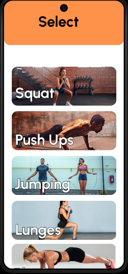

# TrainEZ 🎯


## Basic Details
### Team Name: CODETTES


### Team Members
- Member 1: Anamika S Nair - [GEC Thrissur]
- Member 2: Harichandana M - [GEC Thrissur]
- Member 3: Sneha Aravind  - [GEC Thrissur]

### Hosted Project Link
[mention your project hosted project link here]

### Project Description
TrainEZ is a **personal workout trainer app** that helps users achieve their fitness goals through **guided exercises** and **real-time feedback**. It uses **pose estimation** to analyze movements, provides **angle-based corrections**, and offers **customizable workout plans** tailored to individual goals. The app ensures users perform exercises correctly while tracking their progress for a seamless fitness experience.

### The Problem statement
TrainEZ solves the "I-think-I’m-doing-this-right-but-I’m-probably-not" problem. No more awkward squats or questionable pushups—our app uses real-time pose detection to guide you like a sassy gym buddy. It’s your personal trainer, comedian, and cheerleader all in one. Work out smarter, laugh harder, and avoid looking like a confused flamingo! 🚀💪

### The Solution
We’re turning workouts into a **real-time game**, where your squats get instant **feedback** like “Perfect!” or “Not Enough Depth!” 🎯  
Level up, earn badges, and compete with yourself or friends—because fitness should feel like a **challenge, not a chore!** 🏆💪  
With a virtual coach cheering you on, every rep counts—**so squat like a champ and crush your goals!** 🚀😎🔥

## Technical Details
### Technologies/Components Used
For Software:
- Python,Dart
- Flutter,Flask,Medipipe Pose,Open CV
- Flask (Python) Libraries
    Flask
    Flask-SocketIO
    Flask-CORS
    opencv-python-headless
    mediapipe
    numpy
    base64  
Flutter Libraries (Dart)
    camera
    web_socket_channel

### Implementation
For Software:
# Installation
#!/bin/bash

🚀 Installing Flutter dependencies...   
```bash flutter pub add camera web_socket_channel ```

🐍 Setting up Python environment...   
``` bash python -m venv venv```

📦 Installing Python dependencies..   
```bash
    pip install --upgrade pip
    pip install flask flask-socketio flask-cors opencv-python-headless mediapipe numpy
```

# Run
- Run Flask Server   
  ```bash source venv/bin/activate```
- Run Flutter App
  ```bash flutter run```

### Project Documentation
For Software:

# Screenshots (Add at least 3)

Displays the app's branding.


Allows users to create an account.


Lets users choose fitness goals like weight gain or weight loss.


Shows a list of exercises based on the selected goal.

(Detect2.png)
Analyzes user exercise form using image recognition for real-time feedback.


# Diagrams

*Add caption explaining your workflow*

For Hardware:

# Schematic & Circuit

*Add caption explaining connections*


*Add caption explaining the schematic*

# Build Photos


*List out all components shown*


*Explain the build steps*


*Explain the final build*

### Project Demo
# Video
[Add your demo video link here]
*Explain what the video demonstrates*

# Additional Demos
[Add any extra demo materials/links]

## Team Contributions
- [Name 1]: [Specific contributions]
- [Name 2]: [Specific contributions]
- [Name 3]: [Specific contributions]

---
Made with ❤️ at TinkerHub
